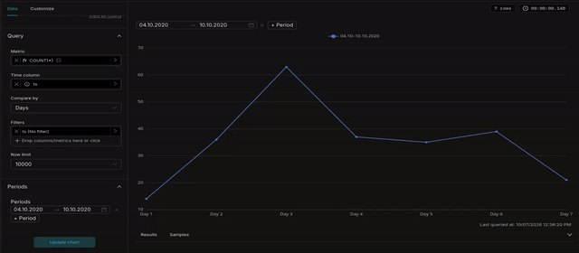

# Period Comparison — плагин графика Apache Superset
---

### 🇷🇺 Русский | [🇬🇧 English](README.md)

---

> **Кастомный плагин Apache Superset**, сравнивающий одну метрику за **до 5
> произвольных периодов** одинаковой длины на одном графике: относительная
> ось X, собственный фильтр дат на самом чарте с кросс-фильтрацией всего
> дашборда, гибкая кастомизация линий и функций вертикального масштаба.

---

## Возможности

- График дашборда (не Native Filter)
- Свой фильтр дат на чарте: 1–5 календарей (range picker) прямо на графике; дефолтные значения задаются в панели настроек. Изменение периода перезапрашивает сам чарт и эмитит кросс-фильтр
- Кросс-фильтрация: фильтр дат эмитит одну клаузу `TEMPORAL_RANGE`, покрывающую span всех периодов (`min(start) : max(end)`), — остальные чарты дашборда фильтруются по сравниваемому окну времени
- Произвольные периоды одинаковой длины — например, пн–пт этой недели и вт–сб две недели назад. Периоды разной длины блокируются валидацией
- Сравнение по часам / дням / неделям / месяцам / кварталам / годам — гранулярность задаёт бакетизацию внутри каждого периода
- Относительная ось X: линии выравниваются по позиции внутри периода («День 1…N»), в тултипе видны реальные даты каждой серии. Часовая гранулярность показывает реальное время бакетов базового периода
- Corner cases: количество недель/месяцев/кварталов считается от начала каждого периода (год по неделям даёт 52–53 бакета; короткие серии получают пропуски; пустые бакеты — разрыв линии, а не ноль)
- Масштаб оси Y: линейный, квадратный корень, логарифмический, квадратичный (power 2) — сглаживает разницу очень больших и очень малых значений. Деления и подписи показывают исходные числа; логарифмическая шкала пропускает неположительные значения
- Кастомизация линий: ломаная / сглаженная / ступенчатая (start|middle|end), область с прозрачностью, значения на узлах, экстремумы (min/max)
- Маркеры и цвета по линиям: у каждой линии переключатель маркера (выкл / авто-форма / явная: круг, квадрат, треугольник, ромб, звезда — авто держит уникальную форму на линию), alias для легенды и цвет; очищенное поле возвращает авто-значение. Там же размер маркеров и D3-формат чисел
- Архитектура одного запроса: окно скана — OR-группа собственных бакет-окон периодов (`extras.where`) — запрашиваются ровно те строки, которые рисуются, без пустого промежутка между далёкими периодами
- Интеграция с датавыми фильтрами: нативный фильтр [period-ranges](https://github.com/Kami-sama322/superset-plugin-filter-period-ranges) берёт управление чартом на себя; чарт также реагирует на любой другой фильтр дат через `extra_form_data`
- Цвета, не заданные в настройках, следуют теме дашборда — график читаем и в тёмной теме

---




## Требования

| Компонент | Версия |
|-----------|--------|
| Apache Superset | 6.1.0 |
| Python | 3.10+ |
| Node.js | 20+ (сборка образа: 22) |
| npm | 10+ |
| React (peer) | ^17.0.2 |
| npm-пакет | `@superset-ui/plugin-chart-period-comparison` |
| Ключ плагина | `chart_period_comparison` |
| Зависимости | `dayjs`, `echarts` (оба уже есть во фронтенде Superset) |

---

## Установка

### Шаг 1. Клонировать репозиторий Superset нужной версии
[](https://github.com/apache/superset/releases/tag/6.1.0)

```bash
git clone https://github.com/apache/superset.git -b 6.1.0;
```

### Шаг 2. Клонировать репозиторий плагина

```bash
git clone https://github.com/Kami-sama322/superset-plugin-chart-period-comparison.git;
```

### Шаг 3. Запустить скрипт автоустановки

```bash
chmod +x superset-plugin-chart-period-comparison/install.sh;
./superset-plugin-chart-period-comparison/install.sh ./superset;
```

> `./superset` — корень репозитория Superset из шага 1. Скрипт устанавливает плагин как **отдельный npm-пакет** в `superset-frontend/plugins/plugin-chart-period-comparison/` и регистрирует его в документированных точках расширения Superset. Скрипт идемпотентен (grep-якоря).

#### Что делает скрипт:

| Действие | Файл |
|----------|------|
| 0. Копирует пакет плагина | `superset-frontend/plugins/plugin-chart-period-comparison/` |
| 1. Регистрирует плагин | `superset-frontend/src/setup/setupPluginsExtra.ts` (`key: chart_period_comparison`) |
| 2. Добавляет `file:`-зависимость workspace | `superset-frontend/package.json` (якорь: `plugin-chart-word-cloud`) |

> Path alias `@superset-ui/plugin-chart-*` уже покрывает этот пакет — отдельная запись в `tsconfig.json` не нужна. `FILTER_SUPPORTED_TYPES` **не** изменяется (это график, а не Native Filter).

---

### Шаг 4б. Ручная регистрация плагина (если install.sh не сработал)

#### 1. Скопировать пакет в каталог plugins

```bash
mkdir -p superset-frontend/plugins/plugin-chart-period-comparison/src
cp -r superset-plugin-chart-period-comparison/src/. superset-frontend/plugins/plugin-chart-period-comparison/src/
cp superset-plugin-chart-period-comparison/package.json superset-frontend/plugins/plugin-chart-period-comparison/package.json
cp superset-plugin-chart-period-comparison/tsconfig.json superset-frontend/plugins/plugin-chart-period-comparison/tsconfig.json
```

#### 2. Зарегистрировать в `superset-frontend/src/setup/setupPluginsExtra.ts`

```typescript
import PeriodComparisonChartPlugin from '@superset-ui/plugin-chart-period-comparison';

export default function setupPluginsExtra() {
  new PeriodComparisonChartPlugin()
    .configure({ key: 'chart_period_comparison' })
    .register();
}
```

Затем выполните `npm install` и `npm run dev-server`.

---

## Запуск Superset в режиме разработки

### Шаг 5. Python-окружение

```bash
cd superset
python -m venv .venv
source .venv/bin/activate
pip install -r requirements/development.txt
```

### Шаг 6. Конфигурация

Скопируйте или сделайте symlink на `superset_config.py` из этого репозитория, либо укажите:

```bash
export SUPERSET_CONFIG_PATH=/path/to/superset-plugin-chart-period-comparison/superset_config.py
```

Плагин не подгружает внешних ресурсов (тайлы карты, рантайм-компиляция шаблонов) — CSP-исключения не требуются. `superset_config.py` из репозитория нужен только для удобной dev-среды (DEBUG, флаги `DASHBOARD_CROSS_FILTERING` / `DASHBOARD_NATIVE_FILTERS`).

### Шаги 7–10. База данных и администратор

```bash
superset db upgrade
superset fab create-admin \
  --username admin --firstname Admin --lastname User \
  --email admin@example.com --password admin
superset init
```

### Шаги 11–13. Backend и frontend

```bash
# терминал 1 — backend
superset run -h 0.0.0.0 -p 8088 --with-threads --reload --debugger

# терминал 2 — frontend (после install.sh + npm install в superset-frontend)
cd superset-frontend
npm install
npm run dev-server
```

---

## Быстрый старт через Docker

В репозитории есть автономный стенд: `Dockerfile` собирает Superset **6.1.0**
с уже встроенным плагином; `docker-compose.yml` монтирует `superset_config.py`
(dev-конфиг) read-only.

**Нужно:** Docker, Docker Compose v2, ~8 GB RAM на сборку фронтенда.

```bash
git clone https://github.com/Kami-sama322/superset-plugin-chart-period-comparison.git
cd superset-plugin-chart-period-comparison

docker compose build    # первый раз: клон Superset 6.1.0 + npm run build (15–40 мин)
docker compose up -d    # init БД, admin/admin, load-examples при первом запуске
```

Открыть **http://localhost:8088** → вход **admin** / **admin**.

При первом запуске контейнер выполняет `superset db upgrade`, создаёт админа
и загружает примеры датасетов (1–3 мин). Повторные запуски пропускают init,
если том сохранён.

**Сброс окружения** (чистая БД и примеры):

```bash
docker compose down -v
docker compose up -d
```

**Проверка плагина:** Charts → + Chart → **Period Comparison**.

---

## Как использовать чарт

1. **Charts → + Chart → Period Comparison**
2. Датасет с колонками:
   - **временная колонка** (например `dttm`) — к ней применяются периоды и гранулярность
   - **Metric** (одна) — число, сравниваемое во всех периодах
   - *(опционально)* adhoc-фильтры и row limit
3. **Query**: метрика, временная колонка, гранулярность **Compare by** (часы / дни / недели / месяцы / кварталы / годы)
4. **Periods**: 1–5 диапазонов одинаковой длины (выбор по датам; последний день включается) — здесь задаются дефолты для календарей на чарте
5. **Chart Options**: тип линии (для ступенчатой появляется **Step position**)
6. Свёрнутые секции: **Line display** (толщина, значения на узлах, экстремумы, размер шрифта, область), **Scale, legend and zoom** (масштаб Y, легенда, зум, цвета сетки/осей), **Colors and labels** (маркер / alias / цвет по линиям, размер маркеров, формат чисел)
7. **На дашборде** включите **кросс-фильтрацию**: календари на тулбаре чарта перезапрашивают сам чарт и фильтруют остальные чарты по span-окну. В Explore календари информационные — периоды настраиваются в панели настроек

### Интеграция с датавыми фильтрами

Установите нативный фильтр
[`superset-plugin-filter-period-ranges`](https://github.com/Kami-sama322/superset-plugin-filter-period-ranges)
и добавьте его на дашборд (в скоуп чарта) — чарт переходит под управление
фильтра: пикеры заменяются плашкой «Periods from filter», диапазоны фильтра
применяются к собственной временной колонке чарта. Пока в фильтре не выбраны
диапазоны, чарт показывает подсказку; «Clear all» не возвращает пикеры,
пока фильтр существует.

Чарт также реагирует на **любой другой фильтр дат** (calendar-фильтр,
встроенный Time range, клаузы `TEMPORAL_RANGE` от других чартов): пикеры
скрываются, настроенные периоды сохраняются и сужаются фильтром; под фильтром
легенда называет фактический диапазон каждой линии (период ∩ окно фильтра).

Приоритет источников периодов: structured-диапазоны period_ranges → любой
применённый фильтр дат → пикеры на чарте (ownState) → конфигурация панели
настроек.

### Пример структуры датасета

| dttm | deals |
|------|-------|
| 2026-09-01 10:00:00 | 120 |
| 2026-09-02 11:30:00 | 98 |
| 2026-10-06 09:15:00 | 45 |

Периоды `2026-09-01 → 2026-09-05` и `2026-10-06 → 2026-10-10` с гранулярностью
«Дни» дадут две линии по 5 бакетов (День 1…5), выровненные по относительной оси
X; запрос просканирует только дни внутри периодов, без промежутка между ними.

---

## Структура пакета

```
superset-plugin-chart-period-comparison/
├── README.md
├── README.ru.md
├── src/
│   ├── index.ts
│   ├── PeriodComparison.tsx       # тулбар-календари + ECharts
│   ├── PeriodsToolbar.tsx         # 1–5 RangePicker, валидация, setDataMask
│   ├── buildQuery.ts              # один span-запрос
│   ├── queryPlan.ts               # планирование запросов
│   ├── transformProps.ts          # rows → серии → опции ECharts
│   ├── periods.ts                 # математика периодов + контракт датовых фильтров
│   ├── scale.ts                   # linear/sqrt/log/power2
│   ├── seriesData.ts              # строки → выровненные серии
│   ├── chartOptions.ts            # генератор опций ECharts
│   ├── crossFilter.ts             # dataMask: ownState + span TEMPORAL_RANGE
│   ├── controlPanel.ts
│   ├── controls/
│   │   ├── PeriodsControl.tsx     # редактор периодов в Explore
│   │   ├── SeriesStyleControl.tsx # маркер/alias/цвет по линиям
│   │   └── ChartColorsControl.tsx # сетка/оси
│   ├── images/thumbnail.png
│   └── *.test.ts
├── package.json
├── install.sh
├── Dockerfile                  # Superset 6.1.0 + production-сборка плагина
├── docker-compose.yml          # локальный demo-стенд
└── superset_config.py          # конфиг dev/Docker
```

---

## Лицензия

Apache License 2.0 (как у Superset)
